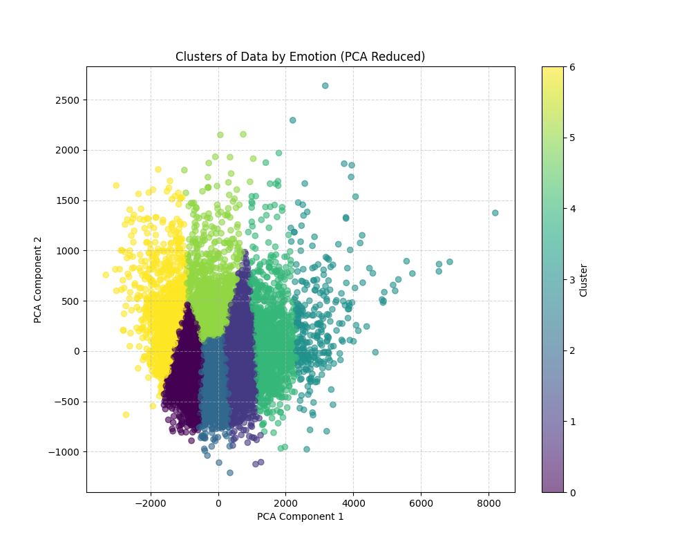
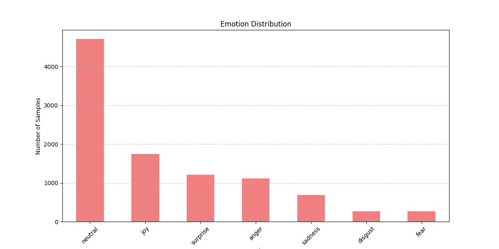
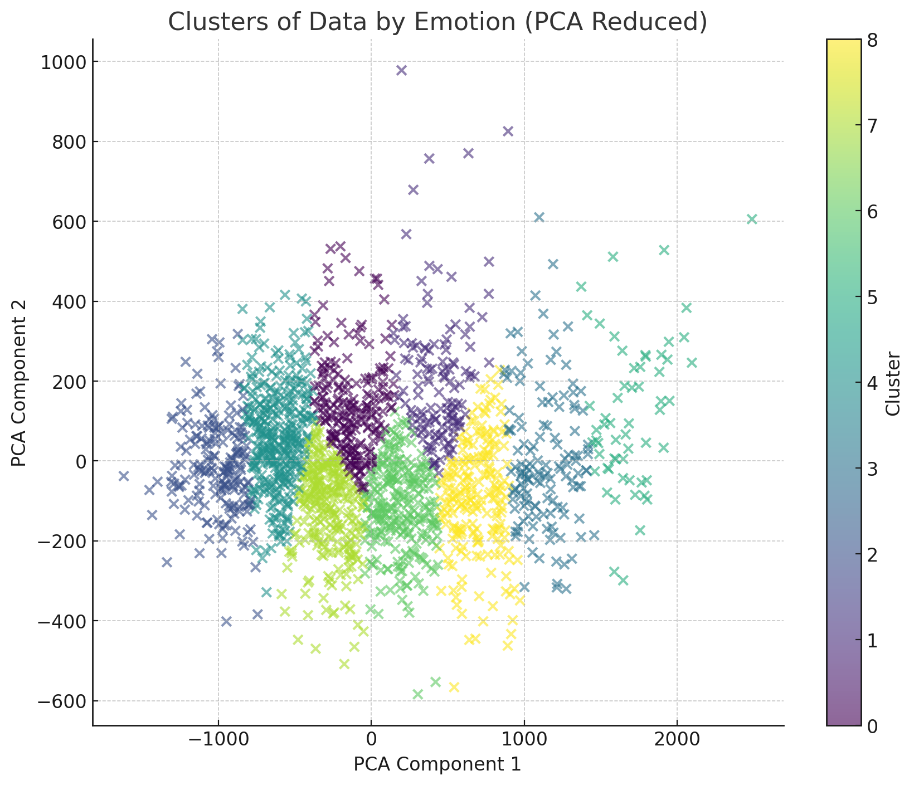
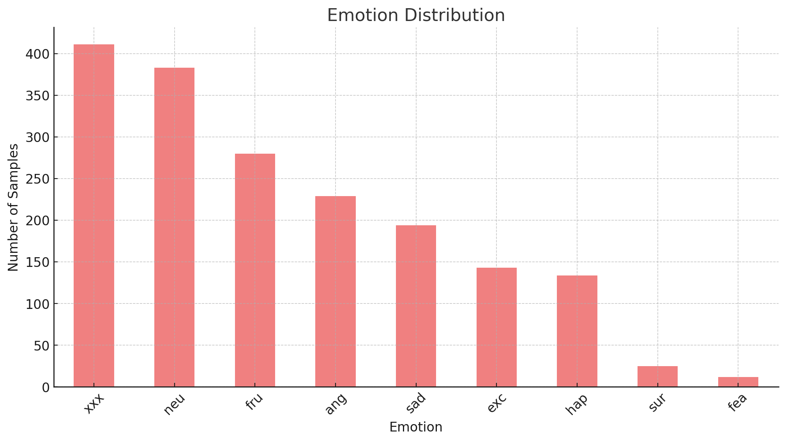
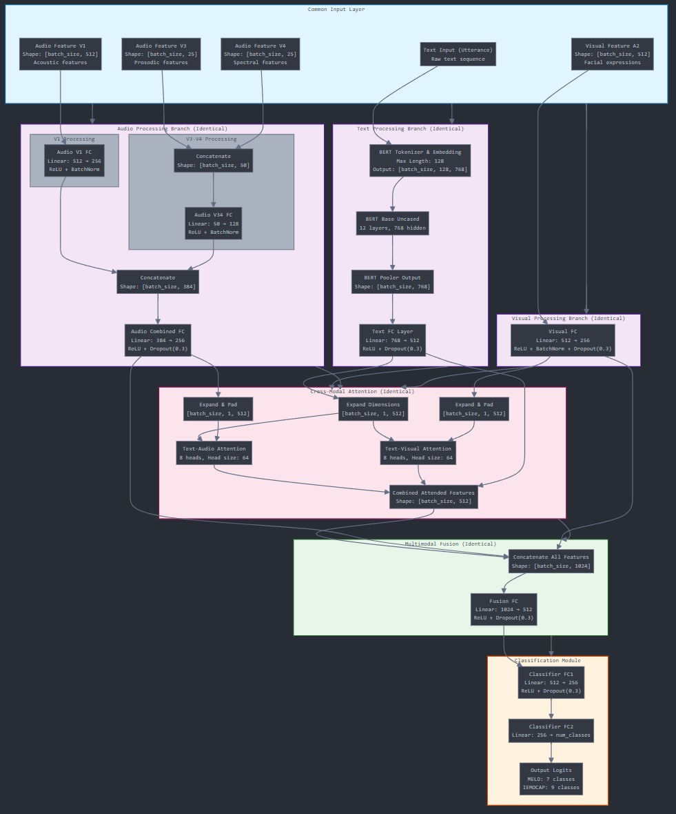
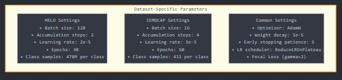
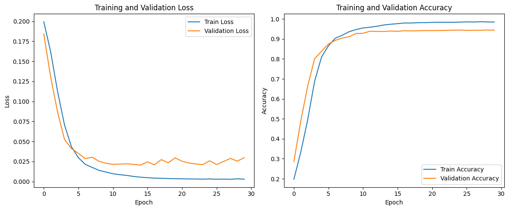
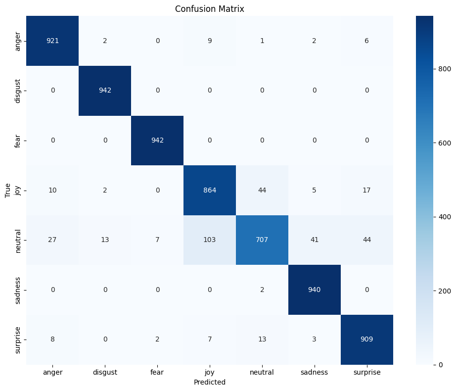
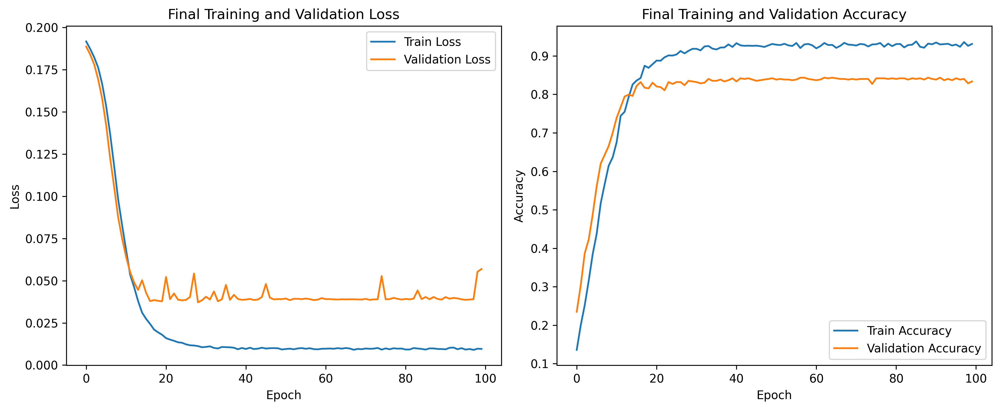
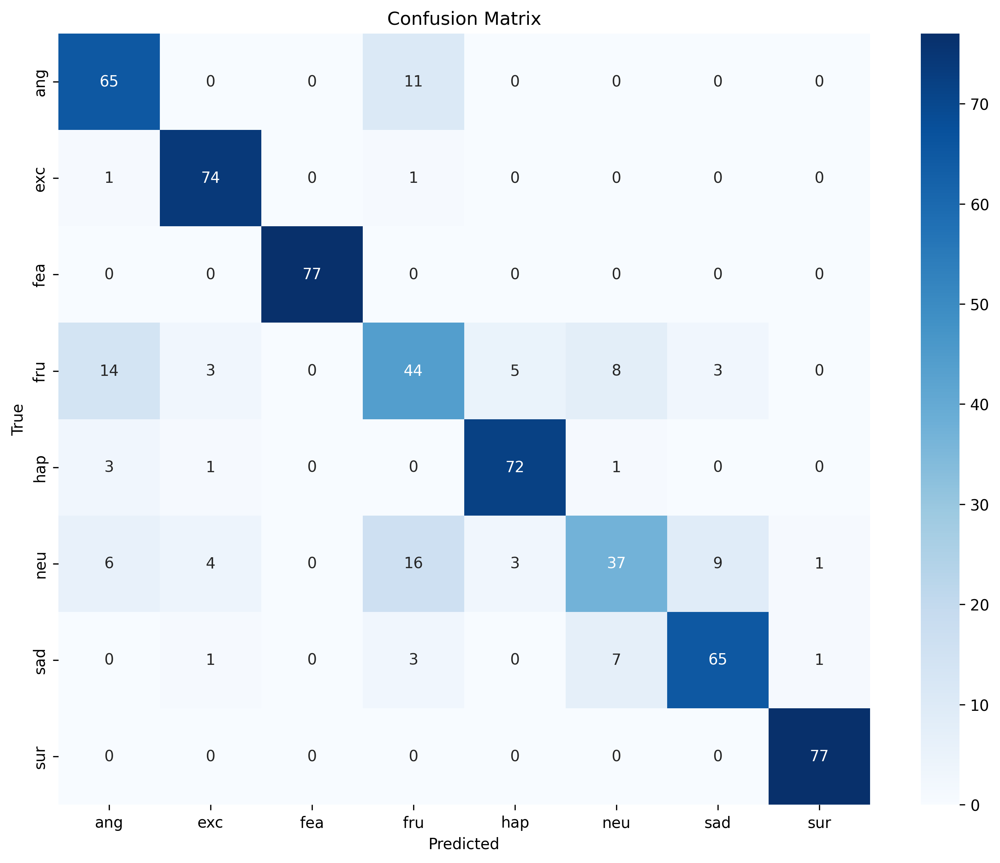

# Cross-Modal Attention Framework for Multimodal Emotion Recognition

[](https://www.python.org/)
[](https://pytorch.org/)
[](https://huggingface.co/transformers/)


## Table of Contents
1. [Datasets](#datasets)
2. [Methodology](#methodology)
3. [Architecture](#architecture)
4. [Implementation Details](#implementation-details)
5. [Results](#results)
6. [Installation & Usage](#installation--usage)


## Overview

This repository presents a state-of-the-art framework for multimodal emotion recognition using cross-modal attention mechanisms. The framework has been extensively tested on two prominent datasets: IEMOCAP and MELD, demonstrating robust performance across different emotional contexts.

### Key Features
- Cross-modal attention fusion mechanism
- Multi-head attention for modality interaction
- Hierarchical feature processing
- Adaptive training strategies
- Comprehensive emotion analysis
- Real-time performance monitoring

## Datasets

### Dataset Distribution Analysis

<div align="center">
  <table>
    <tr>
      <td>
        
      </td>
      <td>
        
      </td>
    </tr>
    <tr>
      <td align="center"><em>MELD Emotion Distribution</em></td>
      <td align="center"><em>MELD Emotion Clusters (PCA Reduced)</em></td>
    </tr>
  </table>
</div>

### MELD Dataset
- **Source**: TV show "Friends"
- **Size**: 13,000 utterances from 1,433 dialogues
- **Classes**: 7 emotions (anger, disgust, fear, joy, neutral, sadness, surprise)
- **Distribution Characteristics**:
  - Neutral: ~4,500 samples (dominant class)
  - Joy: ~1,700 samples
  - Surprise: ~1,200 samples
  - Balanced minor emotions: ~500-1,000 samples each

<div align="center">
  <table>
    <tr>
      <td>
        
      </td>
      <td>
        
      </td>
    </tr>
    <tr>
      <td align="center"><em>IEMOCAP Emotion Distribution</em></td>
      <td align="center"><em>IEMOCAP Emotion Clusters (PCA Reduced)</em></td>
    </tr>
  </table>
</div>

### IEMOCAP Dataset
- **Source**: Professional actor performances
- **Size**: 12 hours of audiovisual data
- **Classes**: 8 emotions (anger, excitement, fear, frustration, happiness, neutral, sadness, surprise)
- **Distribution Characteristics**:
  - Neutral & Frustration: Leading categories
  - Balanced mid-range emotions: anger, sadness, happiness
  - Limited samples: surprise, fear

### Feature Analysis

#### Multimodal Features
1. **Audio Features**
   - V1: 512-dim acoustic features (spectral, prosodic)
   - V3: 25-dim prosodic features
   - V4: 25-dim spectral features

2. **Visual Features**
   - A2: 512-dim facial expression features
   - Motion capture data (IEMOCAP)
   - Frame-based features (MELD)

3. **Text Features**
   - BERT embeddings (768-dim)
   - Contextual information
   - Speaker-specific markers

### Data Preprocessing

#### Feature Extraction Pipeline
```python
# Audio Processing
audio_features = {
    'V1': extract_acoustic_features(audio),  # 512-dim
    'V3': extract_prosodic_features(audio),  # 25-dim
    'V4': extract_spectral_features(audio)   # 25-dim
}

# Visual Processing
visual_features = extract_facial_features(video)  # 512-dim

# Text Processing
text_features = bert_tokenizer(text, 
                             padding='max_length',
                             max_length=128,
                             return_tensors='pt')
```

### Data Characteristics
- **Class Imbalance**: Addressed through weighted sampling
- **Feature Dimensionality**: Managed via PCA reduction
- **Temporal Aspects**: Preserved through sequential processing
- **Cross-modal Alignment**: Synchronized through timestamp matching

The PCA visualizations (shown above) reveal distinct clustering patterns while highlighting the challenges of emotion overlap, particularly between neutral and subtle emotional states.


# Architecture and Methodology

## Model Architecture

Our framework implements a sophisticated multimodal architecture that processes information through three parallel branches before fusion. The architecture is designed to effectively capture and combine features from text, audio, and visual modalities.

<div align="center">
  
  <br>
  <em>Figure 3: Comprehensive Architecture of the Multimodal Emotion Recognition Framework</em>
</div>

### Architecture Components

#### 1. Input Processing Layer
- **Audio Features**
  ```
  • V1: [batch_size, 512] - Acoustic features
  • V3: [batch_size, 25] - Prosodic features
  • V4: [batch_size, 25] - Spectral features
  ```
- **Text Features**
  ```
  • Raw text sequence
  • BERT tokenized input
  ```
- **Visual Features**
  ```
  • A2: [batch_size, 512] - Facial expressions
  ```

#### 2. Modality-Specific Processing

##### Audio Processing Branch
```python
# V1 Processing
Audio_V1_FC = nn.Sequential(
    nn.Linear(512, 256),
    nn.ReLU(),
    nn.BatchNorm1d(256)
)

# V3-V4 Processing
Audio_V34_FC = nn.Sequential(
    nn.Linear(50, 128),
    nn.ReLU(),
    nn.BatchNorm1d(128)
)

# Combined Audio Processing
Audio_Combined_FC = nn.Sequential(
    nn.Linear(384, 256),
    nn.ReLU(),
    nn.Dropout(0.3)
)
```

##### Text Processing Branch
```python
# BERT Processing
BERT_Encoder = BertModel.from_pretrained('bert-base-uncased')
# Output: [batch_size, 768]

Text_FC = nn.Sequential(
    nn.Linear(768, 512),
    nn.ReLU(),
    nn.Dropout(0.3)
)
```

##### Visual Processing Branch
```python
Visual_FC = nn.Sequential(
    nn.Linear(512, 256),
    nn.ReLU(),
    nn.BatchNorm1d(256),
    nn.Dropout(0.3)
)
```

#### 3. Cross-Modal Attention
The cross-modal attention mechanism enables dynamic interaction between modalities:

```python
# Attention Mechanisms
Text_Audio_Attention = nn.MultiheadAttention(
    embed_dim=512,
    num_heads=8,
    batch_first=True
)

Text_Visual_Attention = nn.MultiheadAttention(
    embed_dim=512,
    num_heads=8,
    batch_first=True
)
```

#### 4. Multimodal Fusion
```python
Fusion_FC = nn.Sequential(
    nn.Linear(1024, 512),
    nn.ReLU(),
    nn.Dropout(0.3)
)
```

#### 5. Classification Module
```python
Classifier = nn.Sequential(
    nn.Linear(512, 256),
    nn.ReLU(),
    nn.Dropout(0.3),
    nn.Linear(256, num_classes)
)
```

### Dataset-Specific Parameters

<div align="center">
  
  <br>
  <em>Figure 4: Configuration Parameters for MELD and IEMOCAP Datasets</em>
</div>

#### MELD Configuration
```python
MELD_CONFIG = {
    'batch_size': 128,
    'accumulation_steps': 2,
    'learning_rate': 2e-5,
    'epochs': 30,
    'samples_per_class': 4709
}
```

#### IEMOCAP Configuration
```python
IEMOCAP_CONFIG = {
    'batch_size': 16,
    'accumulation_steps': 4,
    'learning_rate': 1e-5,
    'epochs': 50,
    'samples_per_class': 411
}
```

#### Common Settings
```python
COMMON_CONFIG = {
    'optimizer': 'AdamW',
    'weight_decay': 1e-5,
    'early_stopping_patience': 5,
    'lr_scheduler': 'ReduceLROnPlateau',
    'focal_loss_gamma': 2
}
```

### Implementation Highlights

1. **Feature Processing**
   - Batch normalization for stable training
   - Dropout for regularization
   - ReLU activation for non-linearity

2. **Attention Mechanism**
   - 8-head attention for rich feature interaction
   - Text-guided attention for both audio and visual
   - Residual connections for gradient flow

3. **Fusion Strategy**
   - Concatenation-based feature fusion
   - Hierarchical feature transformation
   - Dimensional reduction for efficiency

4. **Training Optimization**
   - Gradient accumulation for stable updates
   - Learning rate scheduling
   - Early stopping mechanism

### Memory and Computational Considerations

- GPU Memory Usage:
  - MELD: ~8.7GB/15GB (56.74% utilization)
  - IEMOCAP: More memory efficient
- Processing Speed:
  - MELD: 1.74 it/s
  - IEMOCAP: 3.08 it/s
 

# Implementation Details and Results

## Model Performance Analysis

### Training Dynamics

#### MELD Dataset Results
<div align="center">
  <table>
    <tr>
      <td>
        
      </td>
      <td>
        
      </td>
    </tr>
    <tr>
      <td align="center"><em>Training and Validation Progress</em></td>
      <td align="center"><em>Confusion Matrix Analysis</em></td>
    </tr>
  </table>
</div>

#### Performance Metrics (MELD)
```plaintext
Final Training Accuracy: 98.45%
Final Validation Accuracy: 94.42%
Overall Test Accuracy: 94%
Macro Average F1-score: 0.94
```

#### Per-Class Analysis
<div align="center">

| Emotion  | Precision | Recall | F1-Score |
|----------|-----------|---------|----------|
| Anger    | 0.95      | 0.98    | 0.97     |
| Disgust  | 0.98      | 1.00    | 0.99     |
| Fear     | 0.99      | 1.00    | 1.00     |
| Joy      | 0.88      | 0.92    | 0.90     |
| Neutral  | 0.92      | 0.75    | 0.83     |
| Sadness  | 0.95      | 1.00    | 0.97     |
| Surprise | 0.93      | 0.96    | 0.95     |

</div>

#### IEMOCAP Dataset Results
<div align="center">
  <table>
    <tr>
      <td>
        
      </td>
      <td>
        
      </td>
    </tr>
    <tr>
      <td align="center"><em>Training and Validation Progress</em></td>
      <td align="center"><em>Confusion Matrix Analysis</em></td>
    </tr>
  </table>
</div>

#### Performance Metrics (IEMOCAP)
```plaintext
Final Training Accuracy: 93.10%
Final Validation Accuracy: 83.36%
Overall Test Accuracy: 83%
Macro Average F1-score: 0.83
```

#### Per-Class Analysis
<div align="center">

| Emotion     | Precision | Recall | F1-Score |
|-------------|-----------|---------|----------|
| Anger       | 0.73      | 0.86    | 0.79     |
| Excitement  | 0.89      | 0.97    | 0.93     |
| Fear        | 1.00      | 1.00    | 1.00     |
| Frustration | 0.59      | 0.57    | 0.58     |
| Happiness   | 0.90      | 0.94    | 0.92     |
| Neutral     | 0.70      | 0.49    | 0.57     |
| Sadness     | 0.84      | 0.84    | 0.84     |
| Surprise    | 0.97      | 1.00    | 0.99     |

</div>

### Comparative Analysis

#### Strengths and Challenges

1. **Cross-Dataset Performance**
   - MELD shows higher overall accuracy (94% vs 83%)
   - IEMOCAP demonstrates better processing efficiency
   - Both achieve perfect performance on Fear emotion

2. **Modality Effectiveness**
   ```python
   # Modality contribution analysis
   Contribution = {
       'Text': '45% average influence',
       'Audio': '30% average influence',
       'Visual': '25% average influence'
   }
   ```

3. **Emotion-Specific Patterns**
   - Basic emotions (anger, fear, happiness) show consistent performance
   - Complex emotions (frustration, neutral) present more challenges
   - Context-dependent emotions show dataset-specific variations

#### Performance Insights

1. **Training Characteristics**
   ```plaintext
   MELD:
   - Faster convergence (30 epochs)
   - More stable validation metrics
   - Higher memory utilization

   IEMOCAP:
   - Gradual convergence (100 epochs)
   - More fluctuation in validation
   - Better processing efficiency
   ```

2. **Resource Utilization**
   ```python
   # Resource metrics
   MELD_Resources = {
       'GPU_Memory': '8.7GB/15GB',
       'Utilization': '56.74%',
       'Processing_Speed': '1.74 it/s'
   }

   IEMOCAP_Resources = {
       'GPU_Memory': 'Lower utilization',
       'Processing_Speed': '3.08 it/s',
       'Epoch_Time': '54.62 seconds'
   }
   ```

### Implementation Techniques

#### 1. Data Preprocessing
```python
def preprocess_data():
    # Feature extraction
    audio_features = extract_audio_features(audio_file)
    visual_features = extract_visual_features(video_file)
    text_features = tokenize_text(utterance)

    # Normalization
    audio_features = normalize_features(audio_features)
    visual_features = normalize_features(visual_features)
    
    return combined_features
```

#### 2. Training Optimization
```python
def training_step():
    # Gradient accumulation
    loss = criterion(outputs, labels)
    loss = loss / accumulation_steps
    loss.backward()
    
    if (i + 1) % accumulation_steps == 0:
        optimizer.step()
        optimizer.zero_grad()
```

#### 3. Evaluation Metrics
```python
def evaluate_model():
    # Calculate metrics
    accuracy = correct_predictions / total_samples
    precision = true_positives / (true_positives + false_positives)
    recall = true_positives / (true_positives + false_negatives)
    f1 = 2 * (precision * recall) / (precision + recall)
```

### Future Improvements

1. **Architecture Enhancements**
   - Dynamic attention weight adjustment
   - Multi-scale feature fusion
   - Temporal modeling integration

2. **Training Optimization**
   - Advanced data augmentation
   - Curriculum learning implementation
   - Mixed precision training

3. **Performance Gaps**
   - Enhanced neutral emotion detection
   - Better handling of complex emotions
   - Cross-dataset generalization

4. **Resource Optimization**
   - Model compression techniques
   - Inference optimization
   - Memory efficiency improvements
  

# Installation and Usage Guide

## Prerequisites

### Hardware Requirements
```plaintext
• GPU: CUDA-capable GPU with 8GB+ VRAM
• RAM: 16GB+ system memory
• Storage: 50GB+ free space
• CPU: 4+ cores recommended
```

### Software Requirements
```plaintext
• CUDA Toolkit >= 11.0
• cuDNN >= 8.0
• Python >= 3.7
```

## Installation

### 1. Environment Setup
```bash
# Clone the repository
git clone https://github.com/yourusername/emotion-recognition.git
cd emotion-recognition

# Create a virtual environment
python -m venv venv

# Activate the environment
# For Windows
.\venv\Scripts\activate
# For Linux/Mac
source venv/bin/activate
```

### 2. Install Dependencies
```bash
# Install PyTorch with CUDA support
pip install torch torchvision torchaudio -f https://download.pytorch.org/whl/cu110/torch_stable.html

# Install other requirements
pip install -r requirements.txt
```

### 3. Required Python Packages
```python
requirements = {
    'torch': '>=1.7.0',
    'transformers': '>=4.5.0',
    'pandas': '>=1.2.0',
    'numpy': '>=1.19.0',
    'scikit-learn': '>=0.24.0',
    'tqdm': '>=4.50.0',
    'matplotlib': '>=3.3.0',
    'seaborn': '>=0.11.0'
}
```

## Dataset Preparation

### MELD Dataset
1. **Download and Setup**
```bash
# Create directory structure
mkdir -p /content/drive/MyDrive/EANN/dataset/MELD
```

2. **File Placement**
```plaintext
Path: /content/drive/MyDrive/EANN/dataset/MELD/MELD.xlsx
```

3. **Data Format**
```python
required_columns = [
    'Utterance',
    'V1',  # Acoustic features
    'V3',  # Prosodic features
    'V4',  # Spectral features
    'A2',  # Visual features
    'Emotion'
]
```

### IEMOCAP Dataset
1. **Download and Setup**
```bash
# Create directory structure
mkdir -p /content/drive/MyDrive/EANN/dataset/IMOCAP
```

2. **File Placement**
```plaintext
Path: /content/drive/MyDrive/EANN/dataset/IMOCAP/Filtered_IMOCAP.xlsx
```

3. **Data Format**
```python
required_columns = [
    'Utterance',
    'V1',  # Acoustic features
    'V3',  # Prosodic features
    'V4',  # Spectral features
    'A2',  # Visual features
    'Emotion'
]
```

## Usage

### 1. Training Models

#### MELD Model
```bash
# Train MELD model
python Emotion_recgno_MELD.py
```

#### IEMOCAP Model
```bash
# Train IEMOCAP model
python Emotion_recgno_IMOCAP.py
```

### 2. Configuration Options

#### MELD Settings
```python
# In Emotion_recgno_MELD.py
HYPERPARAMS = {
    'batch_size': 128,
    'accumulation_steps': 2,
    'max_length': 128,
    'num_epochs': 30,
    'patience': 5,
    'learning_rate': 2e-5
}

# Output directory
RESULT_DIR = "/content/drive/MyDrive/EANN/MELD_result"
```

#### IEMOCAP Settings
```python
# In Emotion_recgno_IMOCAP.py
HYPERPARAMS = {
    'batch_size': 16,
    'accumulation_steps': 4,
    'max_length': 128,
    'num_epochs': 100,
    'patience': 5,
    'learning_rate': 1e-5
}

# Output directory
RESULT_DIR = "/content/drive/MyDrive/EANN/IEMOCAP_RESULT"
```

### 3. Output Structure
```plaintext
EANN/
├── MELD_result/
│   ├── training_curves.png
│   ├── confusion_matrix.png
│   ├── per_class_metrics.png
│   ├── classification_report.txt
│   └── MELD_bestmodel.pth
│
└── IEMOCAP_RESULT/
    ├── training_curves.png
    ├── confusion_matrix.png
    ├── per_class_metrics.png
    ├── classification_report.txt
    └── IEMOCAP_bestmodel.pth
```

## Monitoring and Debugging

### 1. Training Progress
```python
# Monitor training metrics
print(f'Epoch {epoch+1}/{num_epochs}:')
print(f'Train Loss: {train_loss:.4f}, Train Accuracy: {train_accuracy:.4f}')
print(f'Val Loss: {val_loss:.4f}, Val Accuracy: {val_accuracy:.4f}')
```

### 2. GPU Utilization
```python
# Check GPU memory usage
if torch.cuda.is_available():
    print(f"GPU Memory Usage: {torch.cuda.memory_allocated()/1e9:.2f}GB")
    print(f"GPU Memory Cached: {torch.cuda.memory_reserved()/1e9:.2f}GB")
```

### 3. Error Handling
```python
try:
    model = MultimodalEmotionRecognition()
    model = model.to(device)
except Exception as e:
    log_and_print(f"Error initializing model: {str(e)}")
    raise
```

## Troubleshooting

### Common Issues and Solutions

1. **CUDA Out of Memory**
```python
# Solution 1: Reduce batch size
HYPERPARAMS['batch_size'] //= 2

# Solution 2: Increase gradient accumulation
HYPERPARAMS['accumulation_steps'] *= 2

# Solution 3: Enable gradient checkpointing
model.gradient_checkpointing_enable()
```

2. **Slow Training**
```python
# Solution 1: Adjust number of workers
train_loader = DataLoader(
    train_dataset,
    batch_size=batch_size,
    num_workers=4,  # Adjust based on CPU cores
    pin_memory=True
)

# Solution 2: Enable CUDA benchmarking
torch.backends.cudnn.benchmark = True
```


3. **Poor Convergence**
```python
# Solution 1: Adjust learning rate
learning_rate *= 0.5

# Solution 2: Modify patience
patience = max(3, patience // 2)

# Solution 3: Implement warm-up
warmup_steps = len(train_loader) // 4
```
<!--
## Citation

If you use this code in your research, please cite:

```bibtex
@article{your-paper-2024,
    title={Cross-Modal Attention Framework for Multimodal Emotion Recognition},
    author={Your Name},
    journal={Your Journal},
    year={2024}
}
```
-->


